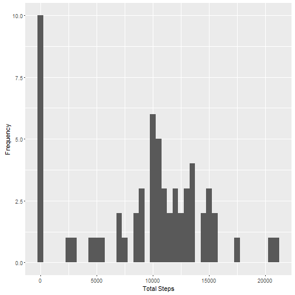
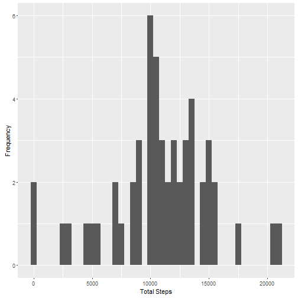
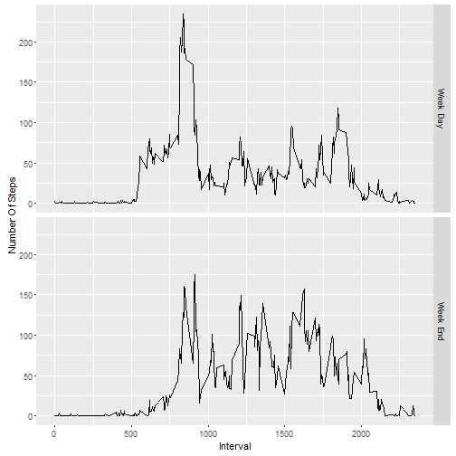

# Reproducible Research: Project 1


```
## Error in library(Hmisc): there is no package called 'Hmisc'
```

## Loading and preprocessing the data
##### 1. Load the data

```r
Activity_Data <- read.csv('activity.csv')
```

-----

## What is mean total number of steps taken per day?

```r
Steps_By_Day <- tapply(Activity_Data$steps, Activity_Data$date, sum, na.rm=TRUE)
```

##### 1. Make a histogram of the total number of steps taken each day

```r
qplot(Steps_By_Day, xlab='Total Steps', ylab='Frequency', binwidth=500)
```



##### 2. Calculate and report the mean and median total number of steps taken per day

```r
Steps_By_Day_Mean <- mean(Steps_By_Day)
Steps_By_DayMedian <- median(Steps_By_Day)
```
* Mean: 9354.2295082
* Median:  10395

-----

## What is the average daily activity pattern?

```r
Average_Steps_Per_Time_Block <- aggregate(x=list(meanSteps=Activity_Data$steps), by=list(interval=Activity_Data$interval), FUN=mean, na.rm=TRUE)
```

##### 1. Make a time series plot

```r
ggplot(data=Average_Steps_Per_Time_Block, aes(x=interval, y=meanSteps)) +
    geom_line() +
    xlab("Interval") + 
    ylab("Number Of Steps") 
```


##### 2. Which 5-minute interval, on average across all the days in the dataset, contains the maximum number of steps?

```r
Most_Steps <- which.max(Average_Steps_Per_Time_Block$meanSteps)
Time_Most_Steps <-  gsub("([0-9]{1,2})([0-9]{2})", "\\1:\\2", Average_Steps_Per_Time_Block[Most_Steps,'interval'])
```

* Most Steps at: 8:35

----

## Imputing missing values
##### 1. Calculate and report the total number of missing values in the dataset 

```r
Number_Of_Missing_Values <- length(which(is.na(Activity_Data$steps)))
```

* Number of missing values: 2304

##### 2. Devise a strategy for filling in all of the missing values in the dataset.
##### 3. Create a new dataset that is equal to the original dataset but with the missing data filled in.

```r
Activity_Data_Altered <- Activity_Data
Activity_Data_Altered$steps <- impute(Activity_Data$steps, fun=mean)
```

```
## Error in eval(expr, envir, enclos): could not find function "impute"
```


##### 4. Make a histogram of the total number of steps taken each day 

```r
Steps_By_Day_Altered <- tapply(Activity_Data_Altered$steps, Activity_Data_Altered$date, sum)
qplot(Steps_By_Day_Altered, xlab='Total Steps', ylab='Frequency', binwidth=500)
```

```
## Warning: Removed 8 rows containing non-finite values (stat_bin).
```



##### ... and Calculate and report the mean and median total number of steps taken per day. 

```r
Steps_By_Day_Mean_Altered <- mean(Steps_By_Day_Altered)
Steps_By_Day_Median_Altered <- median(Steps_By_Day_Altered)
```
* Mean (Altered): NA
* Median (Altered):  NA

----

## Are there differences in activity patterns between weekdays and weekends?
##### 1. Create a new factor variable in the dataset with two levels – “Week Day” and “Week End” indicating whether a given date is a weekday or weekend.


```r
Activity_Data_Altered$dateType <-  ifelse(as.POSIXlt(Activity_Data_Altered$date)$wday %in% c(0,6), 'Week End', 'Week Day')
```

##### 2. Make a panel plot containing a time series plot


```r
Average_Activity_Data_Altered <- aggregate(steps ~ interval + dateType, data=Activity_Data_Altered, mean)
ggplot(Average_Activity_Data_Altered, aes(interval, steps)) + 
    geom_line() + 
    facet_grid(dateType ~ .) +
    xlab("Interval") + 
    ylab("Number Of Steps")
```



